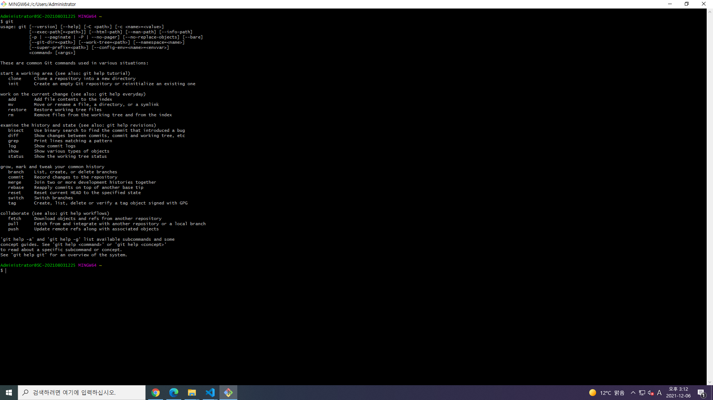

# 메뉴바 만들기

프로젝트 한 줄 설명 소개작성
```
**프로젝트 기간** : 2021.12.06 ~    
```
 메뉴바 만들기

---

**1. git version**
> 깃 설치 여부를 확인하고, 해당 창을 금일 시간이 보이게 캡쳐하여 첨부하세요. (해당 라인은 지워주세요)   



**2. github repository**  
레파지토리 주소: <https://github.com/ekekcl557/-project1206>

**3. git 사용해본 소감**   
> 🙋‍♀️형상관리 도구 git을 사용하기 전과, 사용하고 나서 느낀점을 적어주세요.   

    👉답변: 사용하기 전에는 외장하드를 챙겨서 다니면서 집에서와 학원에서 파일을 사용하였는데 깜박하고 집에 외장하드를 두고온 날이면 이어서 프로젝트를 진행하기 힘들었습니다. 어쩔수없이 없는 환경에서 이어 서 한다음 집에가서 복사, 붙여넣기를 하면서 했던 프로젝트가 git을 알게된후 그럴 필요없이 번거롭지않고 까먹지 않고 프로젝트를 사용할수 있다는 점이 매우 편했습니다.

> 🙋‍♀️현재까지 프로젝트를 진행하면서 어려우셨던 점을 적어주세요. 

    👉답변: class명을 붙이는것이 어려웠고 선생님이랑 했을때는 가능했던 작업이 많이 느려지고 혼자하니 다시 릿셋되는 느낌과 실제로 리셋이되고 많은 검색을 해서 완성했지만 제가 눈으로 보면서 해서 맞는지도 살짝 헷갈리는 경우가 생겼습니다.

> 🙋‍♀️현재까지 프로젝트를 진행하면서 뿌듯했던 점이 있다면 적어주세요. 

    👉답변: 제가 디자인한 이벤트 페이지가 진짜 실제로 홈페이지로 보여지고 만들어지는 과정이 가장 뿌듯했고 생각보다 제가 미적감각이 0% 라는것도 알게되었습니다. 여태까지 공대 행님들 사이에서만 조금 있었던 것도 모르고 있는줄 알았는데 0% 라서 놀랬지만 그래도 제가 디자인한 이벤트 페이지 프로젝트를 보면서 뿌듯했습니다.

> 🙋‍♀️이번주까지 작업목표를 적어주세요.

    👉답변: 지금 이벤트 페이지는 완성했고 하나 더 이벤트 페이지를 만들예정인데 먼저 그 디자인을 이번주안에 끝낼 예정입니다. 맨 바탕으로 만드려니까 너무 어려워서 디자인 작업을 먼저 한후에 마크업 작업을 해야겠습니다. 포폴은 디자인이 막힐때 조금씩 수정하면서 챙길 예정입니다.
